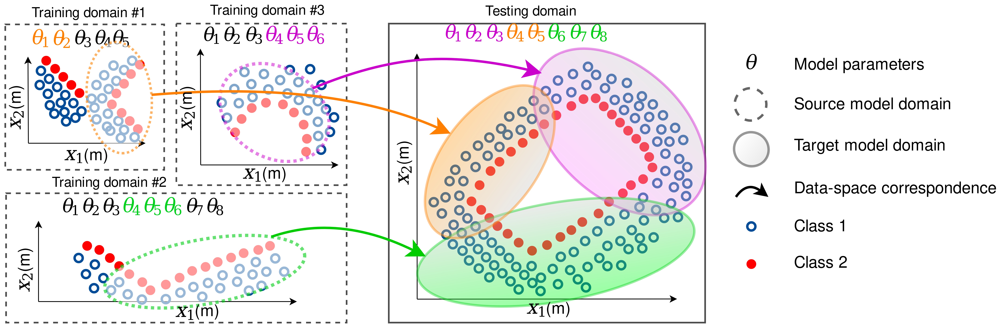

# RSS 2020 - Online Domain Adaptation for Occupancy Mapping

### Repository for the paper "[Online Domain Adaptation for Occupancy Mapping](url_todo)", Robotics: Science and Systems (RSS), 2020
#### Anthony Tompkins*, Ransalu Senanayake*, and Fabio Ramos
Modeling uncertainity in real-time is essential for robots to operate in unknown environments. In this paper, we consider the problem of estimating unceratinity in occupancy in an online fashion. Rather than learning parameters from scratch for every new training batch in an online training setting, can we adapt the parameters that we have already learned to the new training batch? In this paper, we use the theory of *Optimal Transport* to determine the optimal way to morph source LIDAR beams to target LIDAR beams. This transformation allows us to transfer associated model parameters from a dictionary of source domains to a target domain. We call this framework **Parameter Optimal Transport (POT)**. By using the transferred parameters as informative priors, they can also be used to further improve the model accuracy. We call this refinement process **Refined Parameter Optimal Transport (RePOT)**.

### Backgroud
* [Bayesian Hilbert Mapping (BHM)](https://github.com/RansML/Bayesian_Hilbert_Maps) is a technique that uses variational inference to estimate uncertainity in occupancy mapping. It uses kernels to project LIDAR data into a high dimensional linear feature space to capture nonlinear spatial patterns and perferm Bayesian inference to model uncertainty. 
* [Automorphing Bayesian Hilbert Maps (ABHM)](https://github.com/MushroomHunting/autormorphing-kernels) learns all geometry-dependent parameters and hyperparameters of BHM in an offline fashion. 
* This paper proposes a technique to online estimate all the parameters and hyperparameters merely by comparing the similarity among environments. 

**Video**: [https://youtu.be/qLv0mM9Le8E](https://youtu.be/qLv0mM9Le8E)
**[Full paper with appendix](url_todo)**

<p align="center">
  
</p>

<p align="center">
  
</p>

**Instractions to run the code**: TODO
```
test.py
```

**BibTeX**:
```
@inproceedings{tompkins2020domain,
  title={Online Domain Adaptation for Occupancy Mapping},
  author={Tompkins, Anthony and Senanayake, Ransalu and Ramos, Fabio},
  booktitle={Proceedings of the Robotics: Science and Systems (RSS)},
  year={2020}
}
```
